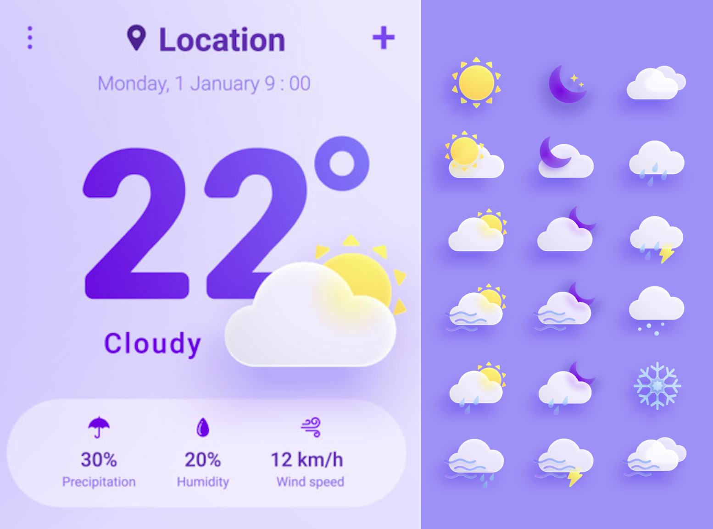

# Project Enhancement: Weather UI with State Transitions and Animated Icons

## Overview

Based on the starter project located at [GitLab Repository](https://gitlab.com/alex6395030/prueba-tecnica), we aim to recreate the attached weather interface to display real-time weather information. This includes implementing transition animations for the change in state of the displayed data. Furthermore, the icon representing the current weather condition (sunny, cloudy, rainy, etc.) should also be animated when entering and exiting the screen.

## Objectives

1. **Replicate Attached Weather UI**: Create a layout that resembles the attached interface for showing weather data.
2. **State Transition Animations**: Implement smooth transitions for updating the weather information.
3. **Icon Animation**: Add entry and exit animations for the weather icon.

## UI

